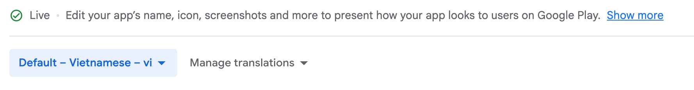
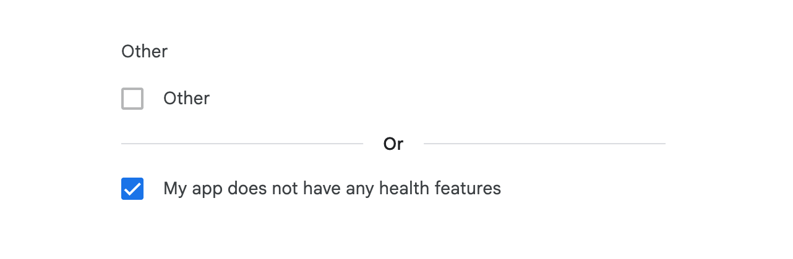
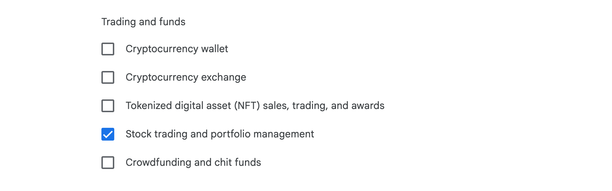
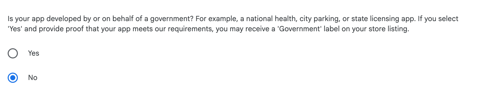
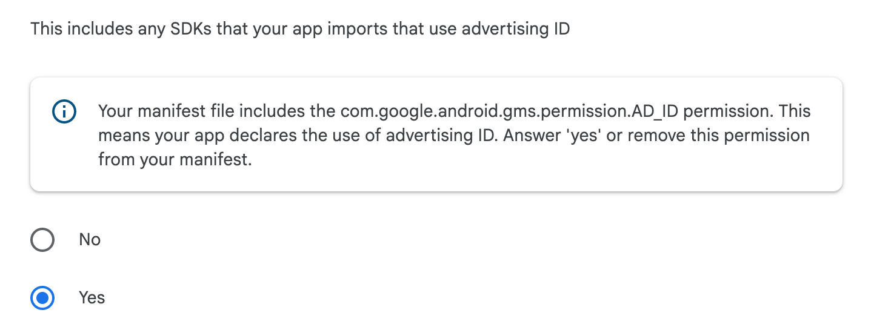
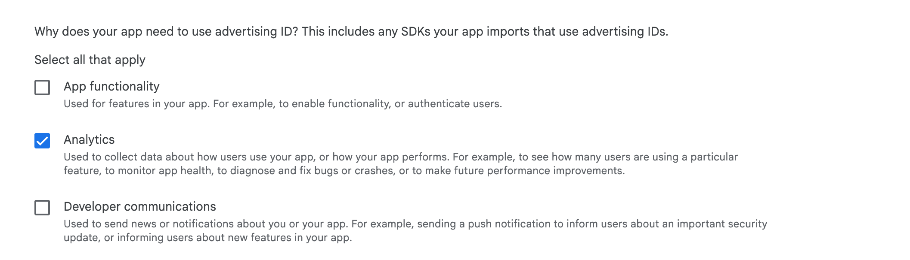
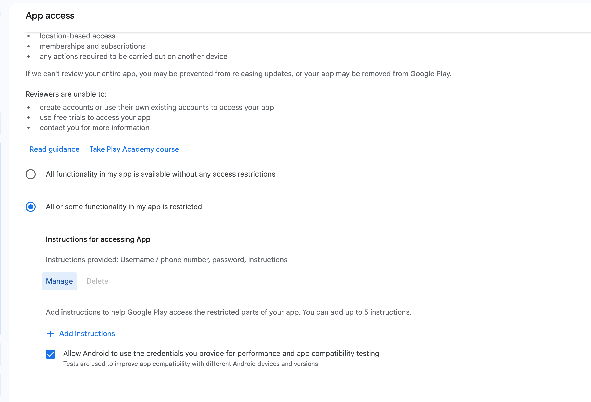
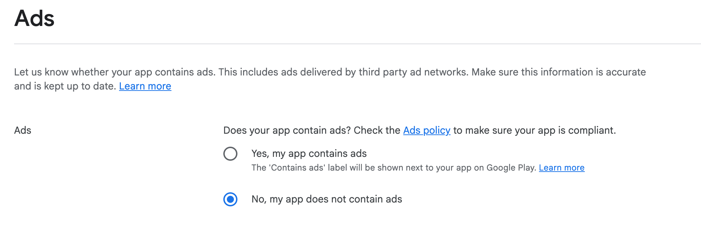
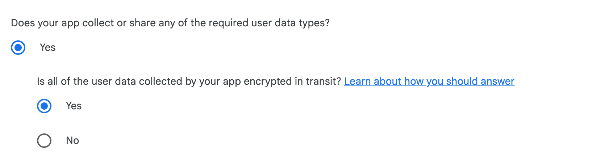
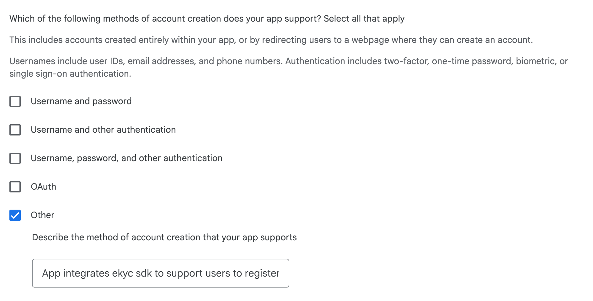

# Quy trình setup cài đặt app    
  
  
## Vào Grow users -> Store settings   
  
b1:  Cài đặt app category  
	- App or game: Chọn APP  
	- Category <Ứng dụng gì>: ví dụ Finance  
b2: Cài đặt Store listing contact details  
	- Thêm enail address: chủ ứng dụng   
	- Thêm số điện thoại liên hệ   
	- website: website của ứng dụng   
  
## Vào Grow users -> Store listings   
  
b1: Chọn ngôn ngữ mặc định cho ứng dụng trên giao diện   
  
  
b2: Cài các thông tin trong Listing assets 	  
	- App name: Tên ứng dụng   
	- Short description: Mô tả ngắn <80 ký tự  
	- Full description: Mô tả chii tiết của ứng dụng giới hạn 4000 ký tự   
	- App icon: ảnh jpeg kích thước 512x512, <1MB dung lượng   
	- Feature graphic: Ảnh quảng cáo cho ứng dụng hiển thị trên chợ 1024x500, <15MB  
	- Phone screenshots: Ảnh chụp màn hình các chức năng của ứng dụng ảnh PNG, JPEG dưới 8 MB, tỉ lệ 16:9 hoặc 9:16  
	- Với ngôn ngữ tiếng anh thì ta tương tự thay các thông tin bằng tiếng anh là được còn ảnh thì giữ nguyên   
  
## Vào Monitor and improve -> Policy and programs -> App content : Cài đặt nội dung app   
  
b1: Cài đặt Health apps: Ứng dụng có các chức năng liên quan đến sức khỏe dinh dưỡng hay không nếu không thì chọn không có   
  
  
  
b2: Cài đặt Financial features: Các chức năng liên quan tiền tài chính   
  
  
  
b3: Government apps: App liên quan đến chính phủ   
  
  
  
  
b4: Cài đặt Advertising ID: Là một mã định danh google cung cấp để thực hiện cá nhân hóa quảng cáo, theo dõi chiến dịch quảng cáo hoặc thống kê người dùng  
  
Nếu có sử dụng thì  chọn yes   
  
  
Chọn mục đích sử dụng id này là gì   
  
  
  
b5: Chọn Target audience and content: Chọn độ tuổi và các thông tin có liên quan   
  
b5: Chọn Content ratings: Chọn các tiêu chí về độ tuổi,   
  
b6: Chọn các tiêu chí trong App access: Cung cấp tài khoản review app để google truy cập được vào các chức năng của ứng dụng   
  
  
  
 b7: Chọn Ads: Cài xem app của mình có quảng cáo hay không   
  
  
b8: Chọn Privacy Policy: cài đặt link chính sách bảo mật cho app   
  
b9: Chọn Data safety: Cài các thông tin bảo mật dữ liệu   
- Chọn xem app của mình có thu thập hoặc chi sẻ bất kỳ dữ liệu người dùng nào không   
	  
  
  
  
- Chọn xem phương thức tạo tài khoản:   
  
  
- Thêm Link xóa tài khoản, xóa dữ liệu người dùng   
  
  
- Chọn các kiểu thông tin thu thập trong Data types: Persional Info, Message, Device or other IDs  
- Với các thông tin mà ta thu thập chọn ở trên thì cần trả lời các câu hỏi chi tiết về lý do và các  
  
  
  
  
  
  
  
